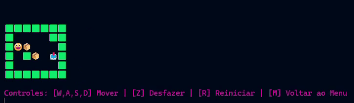

# Sokoban-Prolog



## Descrição do Projeto

Este projeto é uma implementação em terminal do clássico jogo de lógica **Sokoban**, desenvolvida em **Prolog**.  
O jogador (😀) deve empurrar todas as caixas (`📦`) até suas posições corretas (`📥`) no mapa, usando o menor número de movimentos possível.

Assim como a primeira versão (em **Haskell**), esta implementação foca em **organização modular** e **arquitetura clara**, incluindo:
- Menu inicial para seleção de nível (**fácil**, **médio** ou **difícil**).
- Execução totalmente no terminal.
- Separação entre lógica do jogo, carregamento de mapas e interface.

---

## Como Executar

### 1. Instalar SWI-Prolog
Baixe e instale via [site oficial](https://www.swi-prolog.org/Download.html) ou pelo terminal:

```bash
sudo apt-get install swi-prolog
```
> Versão utilizada neste projeto:  
> `SWI-Prolog 9.2.4`

---

### 2. Rodar o Jogo
Na raiz do projeto, execute o interpretador Prolog e carregue o arquivo principal:

```bash
cd src
swipl
```
## Dentro do interpretador, rode:
```prolog
?- [main].
?- executar.
```

## Estrutura do Projeto

```
Sokoban-Prolog/
├── data/
│ └── maps/ # Mapas em Prolog (fácil, médio e difícil).
├── src/
│ ├── main.pl # Ponto de entrada do jogo.
│ ├── controller.pl # Controla fluxo do jogo (inputs e atualizações).
│ ├── core/ # Lógica central.
│ │ ├── game_state.pl# Regras e manipulação do estado do jogo.
│ │ └── map_loader.pl# Carregamento dos mapas.
│ ├── ui/ # Interface do jogo (menus e exibição).
│ │ └── menu.pl
│ └── utils/ # Utilidades gerais.
│ └── console.pl
└── README.md
```
## Arquitetura
O projeto segue o princípio de **separação de responsabilidades**:
- **main.pl**: Inicia o jogo e conecta os módulos.
- **controller.pl**: Gerencia fluxo entre entrada, lógica e saída.
- **core**: Implementa regras do Sokoban e manipulação do estado.
- **ui**: Exibe menus e controla interação com o jogador.
- **utils**: Funções auxiliares para console.

## Equipe de Desenvolvimento
- Anthony Willy  
- Diogo Medeiros  
- Eduarda Viana  
- João Antonio  
- Tamires Santiago

## Licença
Este projeto é distribuído sob a licença BSD 3-Clause.
